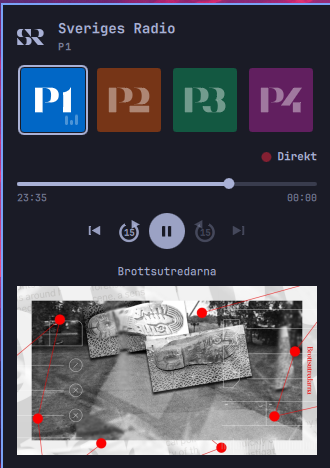

# Sveriges Radio for Omarchy

An SR monogram in the Omarchy bar. Click it and you get P1, P2, P3 and P4 as
channel buttons:

- **Press a channel** — tunes in.
- **Press the playing channel again** — stops.
- **Press a different channel** — switches to it.

One stream plays at a time, always.



## Playing

Once something is playing, the transport appears.

- **Direkt** — a lit red lamp means you are on the live edge. Step back and it
  becomes a button that returns you there.
- **The timeline** spans the programme currently being heard, labelled with its
  broadcast start and end. Click or drag anywhere in it to seek. The bright
  section is what can actually be reached; a second, dimmer marker shows where
  live has got to once you are behind it.
- **↺ 15 / ↻ 15** jump a quarter minute either way, and carry on across
  programme boundaries: step back off the start of a programme and you land at
  the end of the one before, step forward off its end and you land at the start
  of the next. Forward never runs past what has actually been broadcast — off
  the end of the programme on air, it rejoins the live feed rather than walking
  into the future.
- **|◀** goes to the beginning of the programme you are hearing. Press it again
  within three seconds and it steps back to the programme before that — the
  convention every music player uses. Keep pressing and it keeps walking back
  through the day's schedule, skipping programmes SR has not published.
- **▶|** advances to the next programme. The programme on air is played from
  its beginning like any other; pressing forward once more from inside it is
  what joins the live broadcast. A programme that plays out to its end advances
  on its own in the same way.

The schedule is treated as one continuous timeline, which is what lets seeking
cross programme boundaries rather than stopping dead at them.

Hovering a channel puts its full station name in the panel header, which is
where you can see which regional station P4 is pointed at.

### How far back you can go

About three hours, on any programme.

SR's live HLS stream (`srapi/<id>.hls`, one of the URLs its own audio-template
API lists) carries a rolling DVR window of roughly three hours, stamped with
absolute times. That is what SR's own apps rewind through, and it does not
depend on the programme having been published as a file. It is also ~192 kbps
where the plain mp3 is ~96.

Small moves use what the player has already buffered. Anything further back
restarts the stream at the right segment, because ffmpeg will not seek inside a
live playlist — so a large jump has a second or two of gap, and lands on a
segment boundary: within about six seconds *after* the moment asked for, never
before it. Going to a programme's start can therefore clip a moment of its
opening, which is the better way to be wrong — the alternative opens with the
end of the previous programme.

Past the window, published files are the only way back. SR publishes most
produced programmes, often while still on air, and generally nothing for live
desks until they finish; stepping back through the schedule uses those.

Pausing counts as stepping back: the broadcast carries on without you, and
resuming picks up where you stopped. **Direkt** returns to the live edge.

## Install

```bash
omarchy plugin add https://github.com/janne/omasr
omarchy plugin enable omasr.radio --section left
```

`plugin add` hands the URL straight to `git clone`, so it needs a real one --
`github.com/janne/omasr` on its own is read as a local path and fails. The
`.git` suffix is optional. Plugins land disabled so you can read the code
first, which is why enabling is a second step.

Decoding is done by **mpv**, which Omarchy already installs -- it is in
`omarchy-base.packages`, so there is nothing to add. The panel says so plainly
if it is ever missing.

### From a checkout

The plugin is a bar widget for `omarchy-shell`, so it lives in
`~/.config/omarchy/plugins/<plugin-id>/`. To run it from a working copy,
symlink it there and let the shell find it:

```bash
ln -sfn "$PWD" ~/.config/omarchy/plugins/omasr.radio
omarchy shell shell rescanPlugins
omarchy plugin enable omasr.radio --section left
```

## Removing it

```bash
omarchy plugin remove omasr.radio
```

That takes it off the bar, unloads it from the running shell, and deletes it —
one step, no restart. Installed from a checkout, it unlinks instead and leaves
the working copy alone.

Your settings live in the widget's entry in `~/.config/omarchy/shell.json`, so
they go with it; re-adding starts from the defaults. Nothing else of yours is
touched: the plugin only ever writes to its own mpv control socket under
`$XDG_RUNTIME_DIR`, and mpv is Omarchy's package, not ours.

To keep it installed but take it off the bar, use `omarchy plugin disable
omasr.radio`. Enabling it again puts it in its default section rather than
where you had it, so pass `--section` if you had moved it.

## Settings

Configured per bar-widget instance, in Setup > Plugins or directly in the
widget's entry in `~/.config/omarchy/shell.json`:

| Key | Default | What it does |
|---|---|---|
| `p4Region` | `P4 Stockholm` | Which of the 26 regional P4 stations the P4 button tunes to |
| `barIcon` | `Channel color` | Tint the bar monogram with the playing channel's brand color, or keep it in the bar's own color |

## Keyboard and IPC

With the panel open: `1`-`4` tune directly, arrows or `hjkl` move the cursor,
`Enter`/`Space` activates it, `s` stops, `Esc` closes. For the transport, `,`
and `.` jump 15 seconds, `p` pauses and `d` returns to live. Middle-clicking
the bar icon stops without opening anything.

Everything is also reachable over the shell's IPC, which is what you bind
Hyprland keys to:

```bash
omarchy shell omasr play p3        # tune in, no panel
omarchy shell omasr playPause p3   # same-channel toggle
omarchy shell omasr stop
omarchy shell omasr status         # "playing P4 Stockholm [live]" | "idle"
omarchy shell omasr toggle         # show/hide the panel

omarchy shell omasr pause          # play/pause
omarchy shell omasr back 30        # seconds, default 15
omarchy shell omasr forward 30
omarchy shell omasr live           # back to the live broadcast
omarchy shell omasr stepBack       # what the |< button does
omarchy shell omasr fromStart      # the current programme from its start
omarchy shell omasr restart        # to the start of the buffer
omarchy shell omasr previous       # step back one programme
omarchy shell omasr next           # step forward one programme
```

## How it works

| File | Role |
|---|---|
| `Panel.qml` | Bar button, popup, keyboard handling, IPC surface |
| `Player.qml` | Playback and seeking, over an mpv child process and its JSON IPC |
| `Schedule.qml` | What is on air, from SR's schedule API; published episode audio |
| `Transport.qml` | Direkt lamp, timeline and buttons; the live/time-shifted states |
| `Timeline.qml` | The scrub bar |
| `TransportButton.qml`, `TransportGlyph.qml` | Controls and their vector icons |
| `ChannelTile.qml` | One channel button and its playing/connecting/dimmed states |
| `ChannelMark.qml` | The P1-P4 wordmarks as vector geometry |
| `SrMark.qml` | The interlocking SR monogram as vector geometry |
| `Channels.js` | Channel table, stream URLs, P4 regions |

**Streams.** The URLs are the official `liveaudio` endpoints from SR's open API
(`https://api.sr.se/api/v2/channels`). Each redirects to whichever edge node
and bitrate SR is currently serving, so there is nothing here to keep in sync
when they move things around. The timeline comes from
`scheduledepisodes/rightnow` on the same API.

**Switching to a file.** The handoff uses mpv's `--start`, so the file opens at
the right moment rather than opening at zero and seeking afterwards, which
would be audible. `omarchy shell omasr status` reports the playhead as a clock
time, so it can be followed across a handoff.

**Walking the schedule.** Stepping between programmes needs the schedule
*around the programme being heard*, not around the live one — otherwise every press finds
the same "previous programme" and replays it. So the channel's full schedule
for today and yesterday is fetched once (`scheduledepisodes?date=`), and each
step looks up what was scheduled either side of whatever is playing. Two days
is enough to cross midnight without another round trip.

A published file is opened at the offset the wall-clock target implies, clamped
into the file. The clamp matters: SR often fills a slot with a repeat whose
file is shorter than the slot it occupies, so an offset taken from the schedule
can point past the end of the file. Clamping also gives a backwards boundary
crossing the behaviour that reads correctly -- landing at the end of the
previous programme rather than off the end of it.

**Logos.** The SR monogram and the four channel wordmarks are drawn with
`QtQuick.Shapes` from Sveriges Radio's 2024 logo artwork rather than shipped as
bitmaps. That keeps them crisp at every bar size and scaling factor, and lets
the bar monogram take the theme's color the way every other Omarchy bar icon
does. The transport icons are drawn the same way.

**Why mpv and not QtMultimedia.** `omarchy-shell` is one long-running process
that owns the bar, the panels and the lock screen. A decoder that wedges or
crashes on a bad stream would take the whole desktop shell down with it. A
child process costs one fork, is killed with a signal, and shows up in the
audio mixer as "Sveriges Radio" so its volume is adjustable like any other app.
It runs with `--no-config`, so a personal `~/.config/mpv/mpv.conf` cannot reach
into the bar widget.

**No Qt Quick Controls popups.** `ToolTip`, `Menu` and the rest are `Popup`s,
and inside a Quickshell layer-shell window they draw nothing while their
overlay quietly swallows every click in the panel. A tooltip on the channel
tiles is what first showed this up: it never appeared, and once the pointer
had been over a tile the panel stopped responding. Anything popup-shaped here
has to be a plain item in the scene instead.

**The control socket.** Every transport control depends on mpv's IPC socket
being live, so when it is not, all of them correctly disable at once -- which
looks exactly like the panel having gone dead. The retry loop is therefore
bound to "there is a child and no usable channel" rather than started and
stopped by hand, so it re-arms itself if a connection is ever lost, and a
connection is only treated as usable once the property subscriptions are
actually on it. `omarchy shell omasr status` reports `seek` or `NOSEEK` so
this is visible rather than guessed at.

Each attempt gets a **fresh** `Socket`. Quickshell's latches its connect
request: once `connected = true` has been asked for and the attempt failed --
which the first one usually does, in the moment before mpv has created the
socket -- asking again does nothing, and neither toggling the property nor
reassigning the path clears it. Recreating the object is the only way to
genuinely retry.

**End of a programme.** A published file running out is a normal end, not a
dropped stream, so it rejoins the live broadcast instead of being retried.
Whether a programme is still on air comes from the schedule rather than the
file's length: SR often fills a slot with a repeat whose file is a different
length from the slot it occupies, so the file's end says nothing about when
the broadcast ends. Seeks also stay a few seconds clear of the end of a file,
because seeking onto EOF ends playback.

**Seeking.** mpv runs with a JSON IPC socket. Rather than polling it, the
player asks mpv to push the properties the transport needs (`time-pos`,
`demuxer-cache-time`, `pause`) and reacts to those, so the playhead and the
live edge each advance on their own.

Whether you are "live" is tracked, not measured. mpv always holds a few seconds
of buffer, so the playhead trails the cache head even during ordinary live
playback; comparing the two would report "time-shifted" forever. Rewinding and
pausing are what actually put you behind, and Direkt is what brings you back.

**Memory.** mpv costs about 85 MiB resident before any caching — that is
libavcodec, not the buffer. The back-cache is a ceiling rather than an
allocation, so it grows with how long you have been listening: roughly another
1 MiB per minute at SR's bitrates, capped at 64 MiB, about an hour.

**Dropouts.** Live streams drop. An unexpected exit reconnects up to three
times, 1.5s apart, before the panel gives up and reports the failure.

**Now playing.** Under the controls: the programme being heard, whatever SR is
announcing over the stream when that says something the programme name does
not, and the programme's cover art, shown whole at its own proportions.

The artwork needs two turns of the API. Every image URL it hands back carries
`?preset=api-default-square`, which crops SR's 16:9 artwork to a square;
asking for the same template *without* a preset gives the picture as composed,
which is what SR's own apps show. And a schedule entry does not always carry
an image — USApodden is one that does not — but every programme does, as
`programimagetemplatewide`, so entries missing one are filled in from their
programme once the day's schedule lands.

## Checking it still works

[`SPEC.md`](SPEC.md) is the behaviour contract — what each control does in each
state, and the rules that hold everywhere. `test/transport.sh` drives the
plugin over its IPC and checks that contract against live radio:

```bash
test/transport.sh            # the whole suite
test/transport.sh seeking    # just the groups matching "seeking"
```

It plays real audio briefly. Some behaviour depends on whether SR has published
the programme currently on air, so the suite asks the API first and checks the
expectations that apply to the case it finds.

Update `SPEC.md` first when behaviour should change, then the tests, then the
code.

## Hacking on it

Editing `Panel.qml` — the manifest's entry point — hot-reloads on save. Edits
to the *other* QML files do not: the shell's QML engine keeps the compiled
types cached, so `rescanPlugins` will keep running the old code. Since most of
the plugin lives outside `Panel.qml`, that is the usual case. Restart the shell
for those:

```bash
omarchy-restart-shell
```

QML errors land in the journal:

```bash
journalctl --user -f | grep -i omasr
```

## Notes

Sveriges Radio's logos and channel marks are SR's trademarks, reproduced here
to identify their channels in a personal desktop client. This project is not
affiliated with or endorsed by Sveriges Radio.

MIT licensed.
